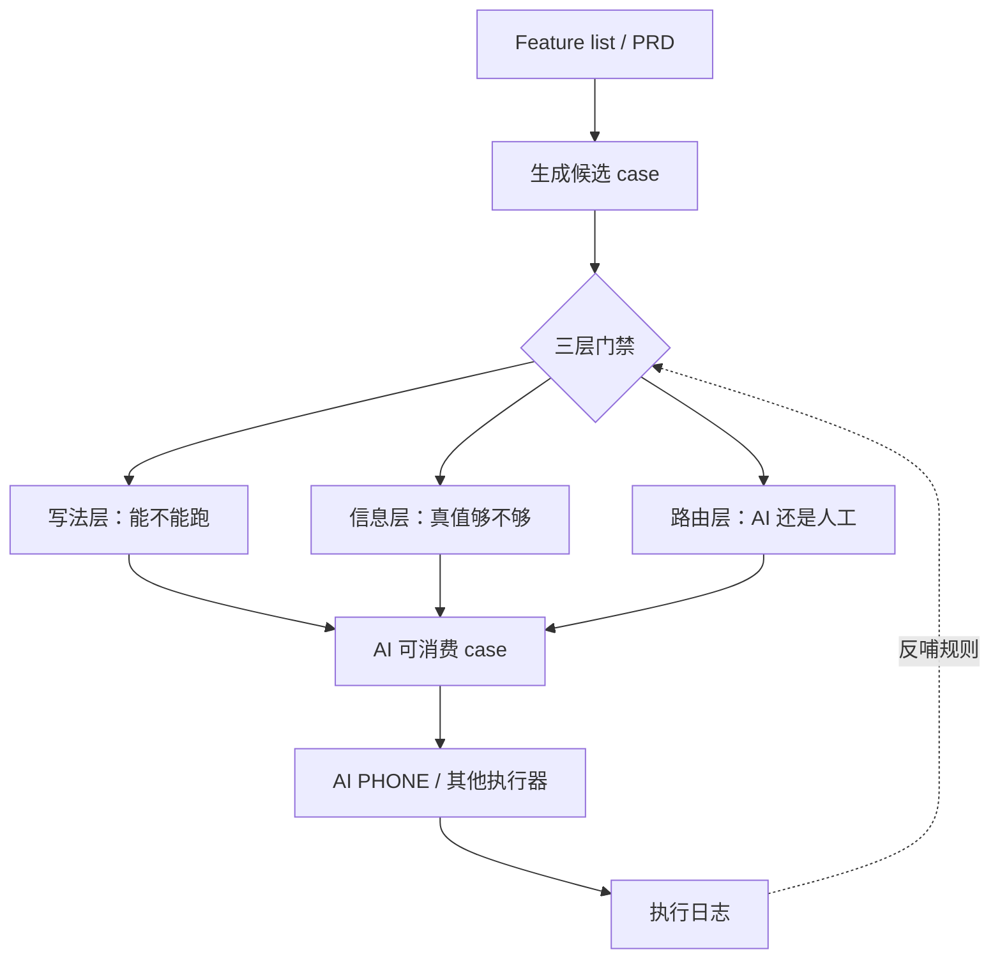

# AI 可消费测试用例模式 / AI-Consumable Test Case Pattern

把 feature list / PRD 生成的测试用例，写成 AI 可以直接消费、执行、验证的结构化脚本。

Turn feature lists and PRDs into structured test cases that AI agents can consume, execute, and verify.

它不是一个可以原样套进所有公司的万能模板。公开版只保留通用方法论和 baseline skill；真正落地时，每个团队都应该结合自己的产品形态、测试环境、数据构造方式、异常注入工具和执行器能力继续打磨。

本项目采用 [MIT License](LICENSE) 开源，鼓励团队 fork、改造，并沉淀自己的内部 AI 可消费 case 规范。

## 核心命题

传统 case 往往是写给有经验的 QA 看的提纲；AI 可消费 case 必须是写给执行器跑的脚本。

一条合格的 AI 可消费 case，应当只依赖标题、前置条件、操作步骤、预期结果四个字段就能执行到底，不依赖 PRD、上下文、领域常识或临场判断。

## 一图理解



## 从 Feature List 到 Case

推荐链路：

```text
feature list / PRD
  -> 解析模块、功能点、规则、流程、验收项
  -> 拆解测试功能点
  -> 生成候选 case
  -> 写法层 lint
  -> 信息缺口反问
  -> 执行方式路由
  -> AI PHONE / 其他执行器消费
```

## 快速开始

1. 阅读 [核心理念](docs/01-core-idea.md)，理解什么是 AI 可消费 case。
2. 查看 [Before / After 示例](examples/bad-case-vs-good-case.md)，感受传统 case 和 AI 可消费 case 的差异。
3. 查看完整 Demo：[Feature List](examples/demo-shopping-feature-list.md) → [生成后的测试用例](examples/demo-shopping-testcase.md) → [执行记录模板](examples/demo-ai-phone-run-note.md)。
4. 如果要接入 AI PHONE，阅读 [与 AI PHONE 的关系](docs/04-with-ai-phone.md)。
5. 如果要改成公司内部规范，按 [5 步适配路径](docs/05-adapt-in-5-steps.md) 处理。
6. 如果要长期打磨规则，按 [端到端验证方法](docs/06-e2e-validation-method.md) 记录每轮执行和规则反哺。
7. 如果要做工程化落地，参考 [规则成熟度与 Linter 路线](docs/07-rule-maturity-and-linter.md)。

## 三层门禁

1. 写法层：case 是否写得可执行。关注单线瀑布、唯一断言、UI 元素有据、字段职责清晰。
2. 信息层：case 是否有真值。关注账号、入口路径、异常注入方式、测试数据、UI 形态等缺口是否反问补齐。
3. 路由层：case 是否适合 AI 自动执行。关注跨端、真实硬件、真实时间窗口、超长流程等边界。

## 规则成熟度

- Must：不满足就不能输出，例如不可编造、不可占位、单线瀑布、唯一断言、信息缺口必反问。
- Should：强烈建议，例如默认冷启动、emoji 剥离、颜色容差。
- Team-specific：团队自定义，例如输出层级、PRD 格式、内部造数工具、人工路由边界。

## 目录结构

```text
README.md                项目入口
LICENSE                  MIT License
CONTRIBUTING.md          贡献指南
docs/                    方法论文档
examples/                通用示例与 before / after 对照
templates/               feature list、规则扩展、公司适配模板
skills/spec-to-testcase/  公开版 skill 工作副本
```

## 公司适配声明

公开版 skill 只能作为起点。每家公司至少需要替换或补齐：

- feature list / PRD 格式
- 测试账号与登录策略
- App 包名、Web 域名或小程序入口
- 测试数据构造工具
- 异常注入方式
- UI 截图 / 设计稿 / 真实控件文案来源
- 自动执行器能力边界
- 人工执行路由规则

这个仓库要传播的核心不是某个具体业务 skill，而是：AI 时代的 case 必须从“人类可理解”升级为“AI 可消费”。

## 维护与协作

这个项目采用 MIT 开源。你可以自由 fork、修改、分发和用于公司内部规范建设，但请保留原始版权和许可声明。

协作上优先使用 Issues / Discussions 交流真实执行失败、规则争议、适配经验和 linter 建议。Pull Request 可以提交，但建议避免提交未脱敏的公司业务材料。

公开版会保持通用和克制：只沉淀可泛化的方法、模板和规则；公司专项规则建议放在各自内部 fork 中维护。

## 文档导航

| 文档 | 内容 |
|------|------|
| [核心理念](docs/01-core-idea.md) | AI 可消费 case 的定义、第一性原则和适用边界 |
| [公司适配指南](docs/02-company-adaptation-guide.md) | 如何把公开 baseline 改成公司内部规范 |
| [发布路线](docs/03-publishing-plan.md) | 从方法论预览到真实案例复盘的发布节奏 |
| [与 AI PHONE 的关系](docs/04-with-ai-phone.md) | 执行器与输入契约的关系 |
| [5 步适配路径](docs/05-adapt-in-5-steps.md) | 公司内部落地的最短路径 |
| [端到端验证方法](docs/06-e2e-validation-method.md) | 如何用真实执行反哺规则 |
| [规则成熟度与 Linter 路线](docs/07-rule-maturity-and-linter.md) | Must / Should / Team-specific 分层与自动检查路线 |
